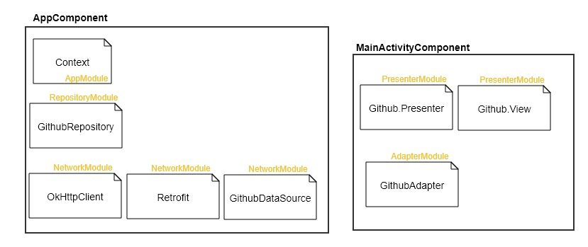

## Languages, libraries and tools used

* [Kotlin](https://kotlinlang.org/)
* Android Support Libraries
* [RxKotlin2](https://github.com/ReactiveX/RxJava/wiki/What's-different-in-2.0)
* [Retrofit](https://github.com/square/retrofit)
* [Dagger 2.11](https://github.com/google/dagger)
* [Glide 4](https://github.com/bumptech/glide)
* [Moshi](https://github.com/square/moshi)
* [Timber](https://github.com/JakeWharton/timber)
* [DeepLinkDispatch](https://github.com/airbnb/DeepLinkDispatch)
* [Spek](https://github.com/spekframework/spek)
* [Stetho](http://facebook.github.io/stetho/)
* [Mokito](http://http://site.mockito.org/)

## Dependencies graph


## Deep Link

### usage
```
adb shell am start -W -a android.intent.action.VIEW -d "testapp://repos/:userName" vingle.hucet.com.vingle
```

